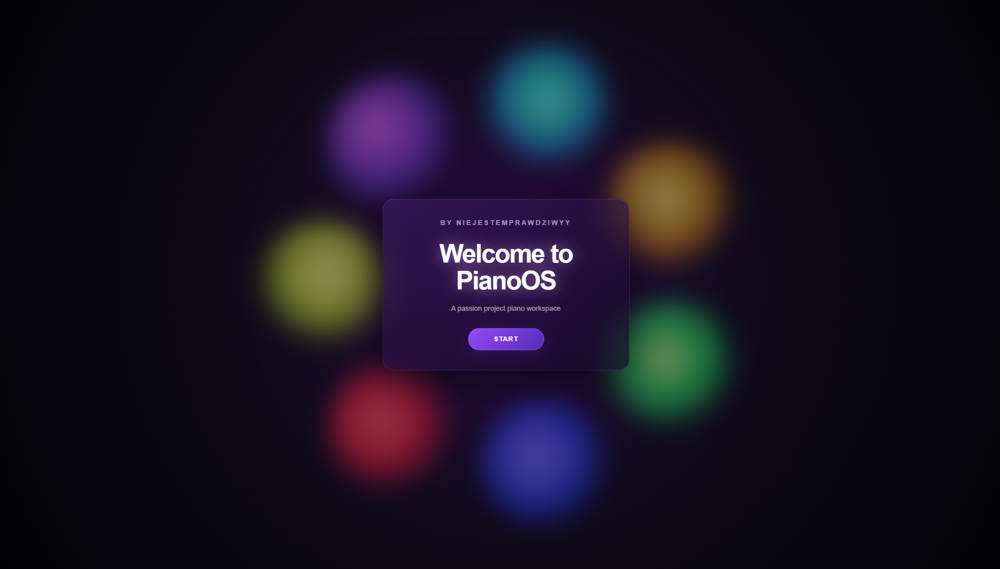
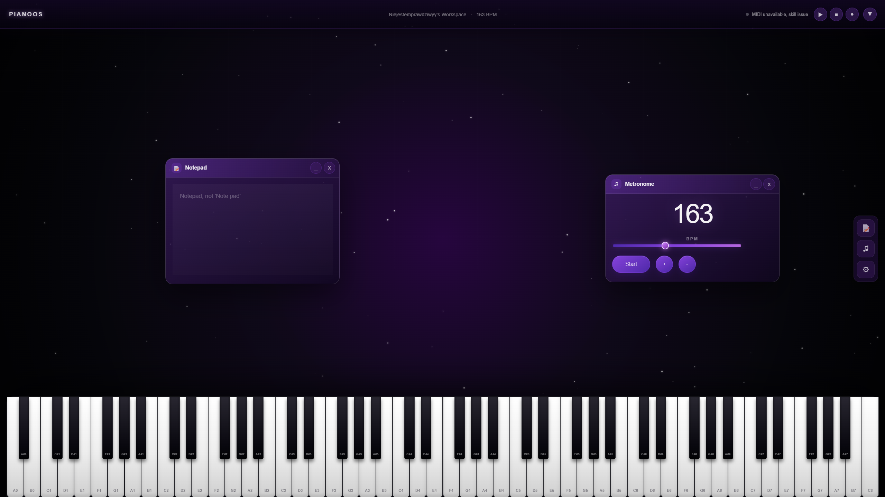

PianoOS

A WebOS, which has notepad and metronome apps and fully playable 88 key piano.

Try it here:https://raw.githack.com/Korsor2137/PianoOS/main/index.html
Note: it may take a few seconds to prepare all the piano sounds

How to run: Yeah, just click the link. Or download it and then run index.html

Features:

-Full 88 key virtual piano, which you can play using mouse, with your pc keyboard (-a- to -'- keys, press capslock  to change octaves to lower) or by connecting your own MIDI piano;

-Keys glow when you play the piano;

-A simple notepad and a metronome which when you minimalize will remember their location adn when they're closed, their position resets;

-A button to hide the piano interface;

-Volume settings which you can change to your liking.

Author's notes:

And why did I decide to make this? Well, I saw how on the WebOS missions there was a lot of awesome stuff, the same main concept and yet they were all so different. So, since I like piano, decided to implement it :D
I plan on making it more customizable in the future, such as changing the background color, or maybe the whole stylistic, making the top right buttons actually work instead of just being a decoration, adding maybe a few piano sounds, and of course more apps so it actually feels like an actual OS. Also, notice a little reference at the title screen?

Full copyright of the sound samples I used: 

MIT License

Copyright (c) 2020 Liam Lee

Permission is hereby granted, free of charge, to any person obtaining a copy
of this software and associated documentation files (the "Software"), to deal
in the Software without restriction, including without limitation the rights
to use, copy, modify, merge, publish, distribute, sublicense, and/or sell
copies of the Software, and to permit persons to whom the Software is
furnished to do so, subject to the following conditions:

The above copyright notice and this permission notice shall be included in all
copies or substantial portions of the Software.

THE SOFTWARE IS PROVIDED "AS IS", WITHOUT WARRANTY OF ANY KIND, EXPRESS OR
IMPLIED, INCLUDING BUT NOT LIMITED TO THE WARRANTIES OF MERCHANTABILITY,
FITNESS FOR A PARTICULAR PURPOSE AND NONINFRINGEMENT. IN NO EVENT SHALL THE
AUTHORS OR COPYRIGHT HOLDERS BE LIABLE FOR ANY CLAIM, DAMAGES OR OTHER
LIABILITY, WHETHER IN AN ACTION OF CONTRACT, TORT OR OTHERWISE, ARISING FROM,
OUT OF OR IN CONNECTION WITH THE SOFTWARE OR THE USE OR OTHER DEALINGS IN THE
SOFTWARE.
